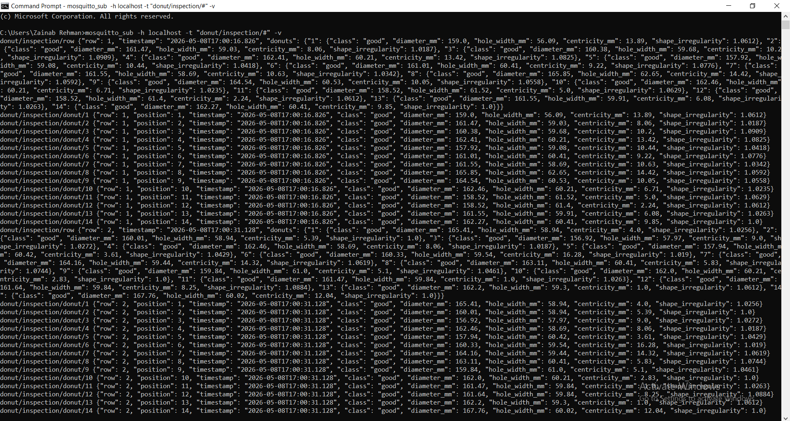
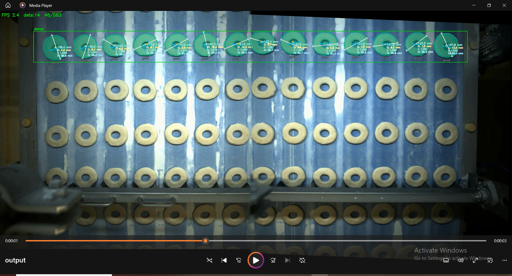

# RTMDet Donut Inspection Pipeline

Real-time computer vision system for automated quality control on donut production lines. It runs RTMDet-Ins instance segmentation through a TensorRT-optimized engine to detect, classify, and physically characterize each donut as it passes through a defined region on the conveyor belt. Per-donut measurements — outer diameter, hole width, centricity offset, and shape irregularity — are derived directly from segmentation masks at inference time, logged to JSON, and optionally streamed to downstream systems via MQTT.

---

## Folder Structure

```
RTMDet_donut_inspection_pipeline/
├── main_data/
│   ├── video.mp4                  ← input video (place here)
│   ├── donut_row_roi.json         ← ROI coordinates
│   ├── donut_classifier.onnx      ← classification model (place here)
│   ├── config.py                  ← pipeline config
│   ├── rtmdet_trt.engine          ← segmentation TensorRT engine (place here)
│   │
│   ├── output.mp4                 ← generated after run
│   └── video.json                 ← generated after run
└── src/
    └── calibrated_inference.py    ← main pipeline script
```

---

## What It Does

- **Detects** donuts inside a defined ROI (Region of Interest) on the conveyor frame
- **Classifies** each donut as `good`, `bad`, or `double`
- **Measures** per-donut physical properties from the segmentation mask:

| Measurement | Description |
|---|---|
| `diameter_mm` | Maximum caliper diameter (rotating-calipers on convex hull) |
| `hole_width_mm` | Maximum diameter of the inner hole |
| `centricity_mm` | Offset between outer centroid and hole centroid |
| `shape_irregularity` | Aspect ratio of minimum-area bounding rectangle (1.0 = perfect circle) |

- **Logs** every row of donuts to `main_data/video.json`
- **Publishes** results to an MQTT broker in real time (optional)

---

## Requirements

### Hardware
- NVIDIA GPU with TensorRT support (tested on Jetson / RTX series)
- CUDA 11.x or 12.x

### Python
Python 3.8+ is required.

### Install dependencies

```bash
pip install opencv-python numpy torch torchvision tensorrt paho-mqtt
```

> **Note:** `tensorrt` must match your installed TensorRT version. On Jetson devices it is pre-installed. On desktop, install it via the [NVIDIA TensorRT documentation](https://docs.nvidia.com/deeplearning/tensorrt/install-guide/index.html).

If you only need inference without MQTT, `paho-mqtt` is optional — the script will still run without it.

---

## Setup

1. Clone or copy the project folder onto your machine.

2. Place your files in `main_data/`:
   - `video.mp4` — your conveyor input video
   - `rtmdet_trt.engine` — your exported TensorRT engine
   - `donut_classifier.onnx` — classsification model onnx 

---

## Running the Pipeline

All commands are run from the **project root** (`xis_RTMDet_donut_pipeline_2026-05/`).

### Basic run (no MQTT)

```bash
python src/calibrated_inference.py \
  --engine main_data/rtmdet_trt.engine \
  --input  main_data/video.mp4 \
  --output main_data/output.mp4 \
  --roi    main_data/donut_row_roi.json
```

### Run with MQTT publishing

```bash
python src/calibrated_inference.py \
  --engine main_data/rtmdet_trt.engine \
  --input  main_data/video.mp4 \
  --output main_data/output.mp4 \
  --roi    main_data/donut_row_roi.json \
  --mqtt
```


## MQTT Setup & Usage

### 1. Install Mosquitto broker

**Ubuntu / Debian:**
```bash
sudo apt install mosquitto mosquitto-clients
```

**Windows:**
Download from [mosquitto.org](https://mosquitto.org/download/)

### 2. Three-terminal workflow

**Terminal 1 — Start the broker:**
```bash
mosquitto -v
```

**Terminal 2 — Subscribe to receive results live:**
```bash
mosquitto_sub -h localhost -t "donut/inspection/#" -v
```

**Terminal 3 — Run inference:**
```bash
python src/calibrated_inference.py \
  --engine main_data/rtmdet_trt.engine \
  --input  main_data/video.mp4 \
  --output main_data/output.mp4 \
  --roi    main_data/donut_row_roi.json \
  --mqtt
```

### MQTT Topic Layout

| Topic | Published when | Payload |
|---|---|---|
| `donut/inspection/row` | A full row of donuts exits the ROI | All donuts in the row as a single JSON object |
| `donut/inspection/donut/<N>` | Alongside the row message | Individual donut measurements |


### Screenshot — MQTT results received in terminal



---

## JSON Output

After every run, results are saved to `main_data/video.json` (same stem as input file). Each row of donuts that passes through the ROI is logged with donuts indexed left-to-right starting at 1.

```json
{
  "row_1": {
    "1": {
      "class": "good",
      "diameter_mm": 159.0,
      "hole_width_mm": 56.09,
      "centricity_mm": 13.89,
      "shape_irregularity": 1.0612
    },
    "2": {
      "class": "bad",
      "diameter_mm": 153.2,
      "hole_width_mm": 48.3,
      "centricity_mm": 21.4,
      "shape_irregularity": 1.142
    }
  },
  "row_2": { ... }
}
```

---

## Visualisation

The output video (`main_data/output.mp4`) shows:

- Coloured segmentation mask per donut (`green` = good, `red` = bad, `dark red` = double)
- White line = maximum diameter axis with tick marks and value label
- Cyan line = hole maximum width axis
- White dot = outer centroid, yellow dot = hole centroid, connecting line = centricity offset
- Class label drawn below each donut
- ROI border (green when donuts present, red when empty)
- FPS counter and detection count overlay

### Screenshot — Annotated output frame



---

